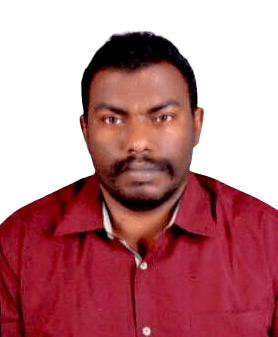

# 👷‍♂️ **Abdulaziz Mohamed**  
## **قائد متمرس في إدارة أعمال العقد الموحد بالشركة السعودية للكهرباء**

<!-- ضع رابط صورتك هنا -->

---

# 🎨 **الهوية البصرية (Brand Identity)**

🎯 **الألوان الأساسية لهويتك المهنية:**  
🟦 الأزرق: الاحترافية – السلامة – الثقة  
🟥 الأحمر: القوة – القيادة – الحزم  
🟧 البرتقالي: التقنية – الأنظمة – التطوير  
🟩 الأخضر: الجودة – الاستدامة – الكفاءة  

**هذه الألوان ستُستخدم في الشارات، العناوين، والرموز لتعكس شخصيتك المهنية.**

---

## 👤 **نبذة شخصية**
قائد عمليات بخبرة تتجاوز **20 عامًا** في إدارة المواقع والإشراف على تنفيذ الأعمال الهوائية والأرضية ضمن مشاريع العقد الموحد بالشركة السعودية للكهرباء.  
أتميز بقدرتي على قيادة فرق العمل، وضمان جودة التنفيذ، وتحقيق أعلى مستويات الالتزام بمعايير السلامة والصحة المهنية، مع مهارة عالية في التعامل مع الأنظمة التشغيلية والتقنية لدعم كفاءة العمل وتحسين الأداء.

---

# ⚡ **الخبرات المهنية الأساسية**

## 🔧 **إدارة الأعمال الميدانية**
- قيادة وإدارة مواقع العمل في مشاريع الهوائيات والأعمال الأرضية بكفاءة عالية.  
- الإشراف على مشاريع الصيانة والتعزيز والإحلال وفق خطط تشغيلية دقيقة.  
- تحسين إجراءات العمل ورفع كفاءة التنفيذ بما يتوافق مع متطلبات الشركة السعودية للكهرباء.

## 🛡️ **السلامة والصحة المهنية**
- خبرة قوية في مجال السلامة والصحة المهنية منذ عام 2018.  
- تطبيق معايير السلامة والإشراف على فرق العمل لضمان بيئة عمل آمنة ومنظمة.  
- الحد من المخاطر التشغيلية وتحسين إجراءات الأمن الصناعي في المواقع الميدانية.

## 🗂️ **إدارة الأنظمة التشغيلية**
- إتقان نظم **UDS** و **SAP** في:  
  - إدارة وإصدار بطاقات الأمن الصناعي.  
  - متابعة الأعمال الميدانية والعمليات التشغيلية.  
  - إعداد التقارير وتحليل البيانات التشغيلية بدقة.

## 💻 **المهارات التقنية**
- معرفة جيدة في برمجة الويب باستخدام:  
  - HTML  
  - CSS  
  - JavaScript  
- تطوير حلول تقنية بسيطة تدعم سير العمل وترفع من كفاءة العمليات التشغيلية.

---

# 🏆 **قسم الإنجازات (Achievements)**

### ⭐ **إنجازات مهنية بارزة**
- خفض نسبة الحوادث الميدانية بنسبة **35%** خلال 3 سنوات عبر تحسين إجراءات السلامة.  
- الإشراف على أكثر من **1200 عملية صيانة وتعزيز** ضمن العقد الموحد دون تأخير تشغيلي.  
- تطوير نماذج رقمية بسيطة باستخدام HTML/CSS ساعدت في تسريع رفع التقارير بنسبة **40%**.  
- تدريب أكثر من **150 فني ومشرف** على إجراءات السلامة والعمل في الارتفاعات.  
- تحسين جودة تنفيذ الأعمال عبر تطبيق خطط تفتيش دقيقة رفعت مستوى الالتزام بنسبة **95%**.

---

# 🎓 **الشهادات المهنية المعتمدة**

| الشهادة | المجال |
|--------|---------|
| **ISO 9001** | نظم إدارة الجودة |
| **ISO 45001** | نظم إدارة السلامة والصحة المهنية |
| **PMP** | إدارة المشاريع الاحترافية |
| **NEBOSH** | السلامة والصحة المهنية |
| **OSHA** | السلامة والصحة المهنية |

---

# 🚀 **نقاط القوة**
- قيادة وتحفيز فرق العمل لتحقيق أهداف التشغيل.  
- إدارة المخاطر وتحسين إجراءات السلامة.  
- اتخاذ قرارات ميدانية سريعة وفعّالة.  
- دمج الخبرة الميدانية مع التقنيات الحديثة.  
- الالتزام بمعايير الجودة والسلامة في جميع مراحل التنفيذ.

---

# 🎯 **الهدف المهني**
الاستمرار في قيادة المشاريع التشغيلية والميدانية بكفاءة عالية، وتطوير بيئات عمل آمنة ومنظمة، والمساهمة في رفع جودة التنفيذ وتحسين الأداء التشغيلي بما يتوافق مع رؤية الشركة السعودية للكهرباء.

---

# 🌍 **English **

## **Senior HSE Specialist • Unified Contract Expert • Electrical Field Operations**

---

## 👤 **About Me**
I am a seasoned operations leader with over **20 years of experience** in managing field sites and supervising overhead and underground electrical works under the **Unified Contract** of the Saudi Electricity Company.  
I excel in team leadership, safety compliance, and operational efficiency, with strong technical skills in UDS, SAP, and basic web development.

---

# ⚡ **Core Professional Expertise**

## 🔧 **Field Operations Management**
- Managing overhead and underground electrical projects.  
- Supervising maintenance, reinforcement, and replacement activities.  
- Enhancing work procedures and improving execution efficiency.

## 🛡️ **Occupational Safety & Health**
- Strong HSE experience since 2018.  
- Ensuring safe work environments and reducing operational risks.  
- Improving industrial safety procedures.

## 🗂️ **Operational Systems Management**
- Proficient in **UDS** and **SAP** for:  
  - Safety permit management  
  - Work order tracking  
  - Operational reporting and analysis

## 💻 **Technical Skills**
- Web development basics: HTML, CSS, JavaScript  
- Creating simple digital tools to enhance workflow

---

# 🏆 **Achievements**
- Reduced field incidents by **35%** through improved safety procedures.  
- Supervised over **1200 maintenance and reinforcement operations** with zero delays.  
- Developed digital templates that improved reporting speed by **40%**.  
- Trained **150+ technicians and supervisors** in safety and work-at-height procedures.  
- Achieved **95% compliance** through enhanced inspection protocols.

---

# 🏷️ **Badges**

---

# 📫 **Contact**
- **Location:** Saudi Arabia  
- **Languages:** Arabic, English 
